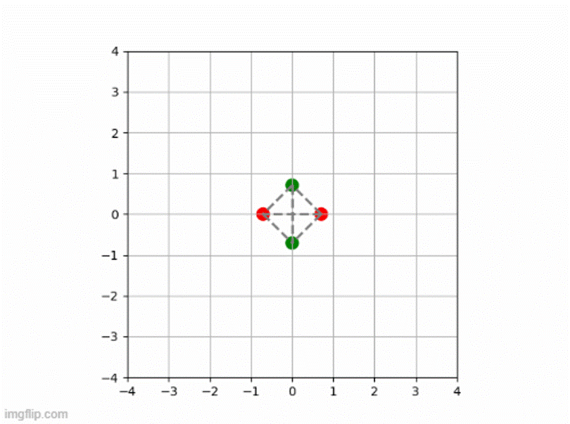

### Simulation of elastic particle networks with binding dynamics 

I have created a Brownian dynamics simulation of the overdamped Langevin equations corresponding to a particle network with elastic connections and firm binding dynamics. 

*Example simulation: 4-particle fully connected network. Green: unbound, red: bound. The dotted lines indicate the elastic connections between partcles.*

#### Physics: 
System design inspired by complex diffusion behaviour exhibited by real world biophysical systems, such as the assembly of SAS-9 rings. The system dynamics consist of: 
- Brownian motion of the individual particles
- Harmonic spring forces
- Stochastic firm bond dynamics with rates 'q_on' and 'q_off'

#### Features

#### Requirements 

#### Usage 
